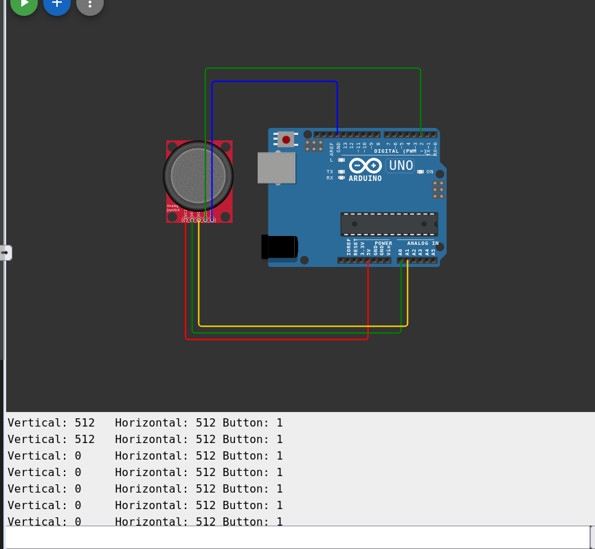
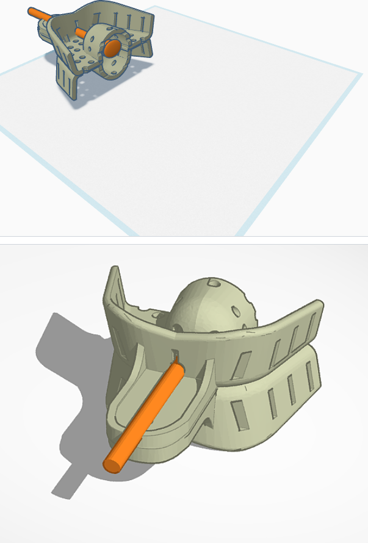
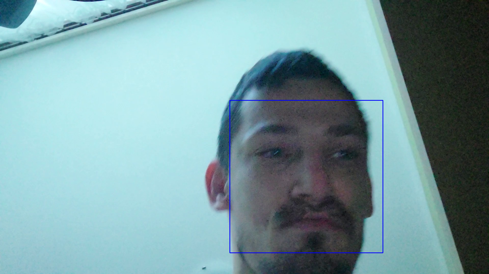
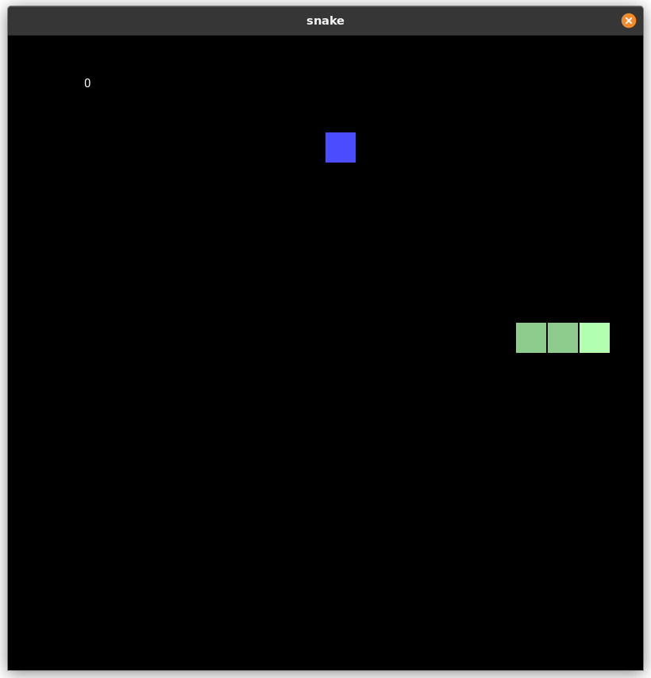

# diplomovka2024

toto je repozitár diplomovky na tému ovládanie modelu vozíka pomocou bio signálov,  
na ceste ku finálnemu cielu bolo zatiaľ vytvorených niekoľko verzii:
# version_1
tento podadresár je 1. verziou programu, ktorý pomocou klávesnice ovláda myš
# server_plus_demo
obsahuje prototyp servera, ktorý bude počúvať http requesty, ktoré budú prichádzať z inej časti programu
# GUI
Toto je jednoduchá grafická aplikácia
# arduino 
Tu sa nachádza časť pre arduino kód, ktorý je určený pre jeho ovládanie
# face_android
Tu sa nachádza časť pre android kód, ktorý je určený na zber snímkou
# diplomovka
obsahuje zdrojáky, pdf.
# screenshoty

# články
[odkaz_tu](diplomovka/clanky)
